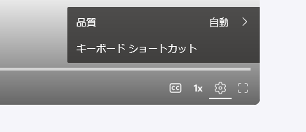
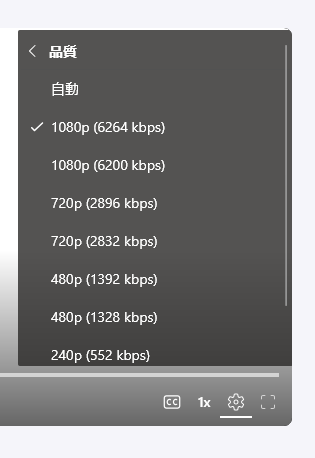

# はねねこボール - v1.1.3

本ゲームは、坂を転がり落ちるボールの「速度」と「音楽のテンポ」が連動した、3D物理アクションゲームです。  
本ゲームは C++ DirectX11 で制作しました。

ボールの速度が遅いと音楽もスロー再生になり、逆に加速しすぎて最高速度に達すると音が止まってしまいます。  
プレイヤーに求められるのは、ただ最速を目指すことではなく、  
「曲が一番心地よく聴こえる **ちょうどいい速度**」を維持してコントロールすること。  
物理的なスピード調整がダイレクトに音楽の正しい演奏へとつながる、  
聴覚と視覚が融合した体験を楽しめます。  

- [実演動画はこちら (OneDriveから共有)](https://jc21-my.sharepoint.com/:v:/g/personal/240343_jc-21_jp/IQDbNu6QCtRgTbJ0xSVoiaIHAbFs-TbK74dxwXnjmFmfAK8?e=15RTvi&nav=eyJyZWZlcnJhbEluZm8iOnsicmVmZXJyYWxBcHAiOiJTdHJlYW1XZWJBcHAiLCJyZWZlcnJhbFZpZXciOiJTaGFyZURpYWxvZy1MaW5rIiwicmVmZXJyYWxBcHBQbGF0Zm9ybSI6IldlYiIsInJlZmVycmFsTW9kZSI6InZpZXcifX0%3D)
- 実演動画で伝えきれなかった [解説動画はこちら (OneDriveから共有)](https://jc21-my.sharepoint.com/:v:/g/personal/240343_jc-21_jp/IQDAZWIwI9FdQKf258i2FRJZAd4f4CSpmz4GqShzGcUBBfE?e=kcDzzP&nav=eyJyZWZlcnJhbEluZm8iOnsicmVmZXJyYWxBcHAiOiJTdHJlYW1XZWJBcHAiLCJyZWZlcnJhbFZpZXciOiJTaGFyZURpYWxvZy1MaW5rIiwicmVmZXJyYWxBcHBQbGF0Zm9ybSI6IldlYiIsInJlZmVycmFsTW9kZSI6InZpZXcifX0%3D)

※[再生画質に関する注意事項はこちら](#sharepoint-player-hint)

## 開発環境

|||
|-|-|
|OS|Windows11|
|メモリ|32GB|
|IDE|Microsoft Visual Studio 2022 / 2026|
|言語|C++ 20 / HLSL (Shader Model 5.0) |
|ライブラリ| [FBX SDK](https://aps.autodesk.com/developer/overview/fbx-sdk) / [dr_libs](https://github.com/mackron/dr_libs) / [ImGui](https://github.com/ocornut/imgui) / [JSON for Modern C++ (Nlohmann-JSON)](https://github.com/nlohmann/json) |
||DirectX11|

## 開発期間

- プロジェクト始動 : 2025年9月29日
- プロジェクト終了 : 未定
- 期間 : 8ヶ月経過 (2026年5月24日現在)

## 実行方法

### exeファイルから実行する方法

- `Assets/` があるディレクトリで `SkyGameBase.exe` を実行してください。

### Visual Studio から実行する方法

- 動作には**FBX SDK 2020.3.9**または**2020.3.7**が必要です。
- 標準インストールを行うか、プロジェクトのプロパティから FBX SDK へのパスを追加してください。
- パスの設定後、`F5`キー または `ローカルWindowsデバッガー`ボタンを押して実行します。

## 操作説明

- ゲーム起動後は**マウスデバイスのみ**使用します。
- ゲーム内に表示される「黄色い円の内側」をドラッグすることで操作します。
- プレイシーンに限り、黄色い円の内外のドラッグ位置で動作が異なります。
  - **黄色い円の内側をドラッグ** : 操作ボールの指定方向への加速
  - **黄色い円の外側をドラッグ** : カメラの視点操作

## 注意事項

- ドラッグ中にカーソルが画面外に出ると予期せぬ動作を引き起こす可能性があるため、  
  なるべく画面内でお戻しいただくか、画面内での操作をお願いいたします。
- ゲームプレイ中はスピーカーやイヤホン、ヘッドフォンを接続し、ぜひ音楽とともにお楽しみください。

## ドキュメント

- [プロジェクト概要](docs/Document.md)  
  ディレクトリ構成やソースコードの分類に関する説明
- [コーディング規約](docs/CodingGuide.md)  
  ソースコードの記述ルールに関する説明
- [実装後の自己評価](docs/Reflections.md)  
  実装によって得られた効果や振り返りの説明
- [アピールポイント](docs/SellingPoints.md)  
  制作時に苦戦した点と、その解決方法についてのまとめ

## VisualStudio のフィルター機能に関して

- Visual Studio上のフィルター機能は使用せず、  
  実際のディレクトリ構成に沿ってソースコードを分類・管理しています。

## 文字コードに関して

- 本プロジェクトのすべてのテキストファイル(ソースコードなど)は、`UTF-8(BOM無し)`を使用しています。

---

<h2 id="sharepoint-player-hint">作品動画の再生画質に関する注意事項</h2>

※Microsoft SharePointの動画プレイヤーの仕様により、画質が粗くなる場合があります。  
右下の歯車マークを押し、「品質」を最高品質の項目を選択していただきますようお願い申し上げます。  

□
