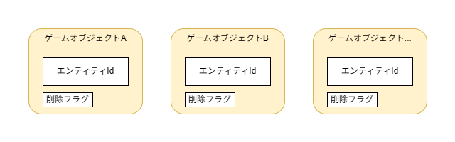
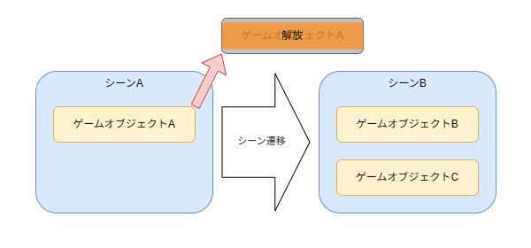
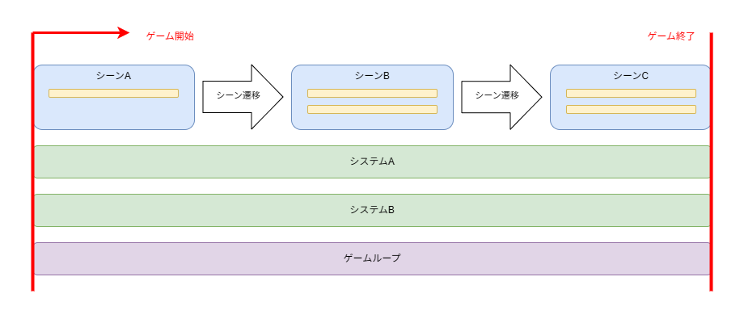
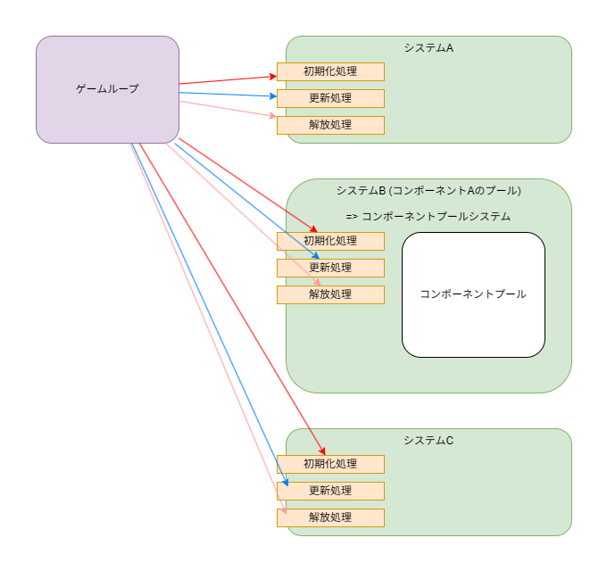
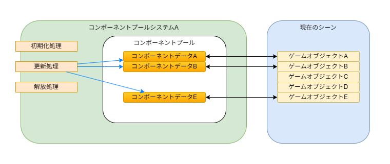

# プロジェクト概要

　本ゲームのプロジェクトは、C++で書かれたソースファイルの総数は  
400を超え、ディレクトリだけでは容易に理解し難い。  
　本ドキュメントでは、理解をサポートするべく、  
プロジェクト概要についてまとめる。

## 概要

　本ゲームのプロジェクトは以下2つから構成される。

1. ゲームベース側  
  　Win32APIやDirectX11を利用したウィンドウ表示とクライアント領域内一連の描画、  
  ゲームループ、物理演算など、ゲーム要素に関係なく必要な部分である。
2. ゲーム側  
  　ゲームベース側の機能を利用し、本ゲーム「はねねこボール」の要素を実装する部分である。

## ソースコードについて

- 使用言語はC++ 20
- ソースコードは`/wtgb/*`, `/Source/*`, `/pch/*`, `/Library/*`内に存在
	- `/wtgb/*` ……… ゲームベース側のソースコードが存在
	- `/Source/*` …… ゲーム側のソースコードが存在
	- `/pch/*` …………… プリコンパイル済みヘッダーが存在
	- `/Library/*`…… ライブラリのソースコードが存在

### ゲームベース側のソースコードについて

　ゲームベース側のソースコードは以下8つから構成される。

1. シングルインクルードヘッダー  
  　 ゲーム側でゲームベース側の機能を使う際、1つのヘッダーファイルをインクルードすることで、  
   ゲームベース側の全機能を利用可能にする。
2. コア機能  
   　ゲームの枠の役割を持つクラスである。  
   `Game`クラスや`GameScene`クラス、`GameLoop`クラスなどである。
3. コア構造体  
   　ゲーム側、ゲームベース側問わず使われる基本構造体である。  
   Vector3やVector2Int、Quaternionなどである。
4. コンポーネント  
   　エンティティにアタッチされるコンポーネントクラスである。  
   ゲーム側でもコンポーネントの追加は可能である。  
   `Transform`クラスや`GameObject`クラス、`ModelMesh`クラスなどである。
5. システム  
   　コンポーネントの更新やシーン内で１つだけ存在するクラスである。  
   コンポーネントの更新を行う「コンポーネントプール」クラスもシステムに含む。  
   `Camera`クラスや`CPTransform`クラス、`Direct3D`クラスなどである。
6. ライブラリのヘッダー  
   　ライブラリを組み込む際のエイリアスである。  
   `FileSystem`(`std::filesystem`)を`fs`に、  
   `NlohmannJson`(`nlohmann::json`)を`json`に  
   エイリアスをつけている。
7. 便利クラス/関数
   　`Ease`クラスや`Mathf`名前空間、`IResource`クラスなどである。
8. ヘルパーヘッダ
   　コンポーネントプールの宣言で頻繁に使用するマクロを定義した。  
   `COMPONENT`や`SETTER`、`COMPONENT_POOL`などである。

#### ゲームベース側の設計思想

1. ECS設計  
   　ECS設計を採用、コンポーネントの展開するメモリ領域が同コンポーネント内で連続した配置になる。  
   これにより、CPUのキャッシュ効率が向上する。  
   毎フレーム更新が必要な動的オブジェクトの総数が増えてもパフォーマンスに影響が出にくくなる効果を期待した。

### ゲーム側のソースコードについて

　ゲーム側のソースコードは以下5つから構成される。

1. ゲームクラス `NekoGame.h/cpp`  
   　ゲームタイトル、ゲームバージョンを設定と、ゲーム内で更新するシステムクラスの登録処理。
2. 各シーン固有部分  
   　各シーンクラス、その他シーンで登場する各エンティティのクラス。  
   `/Source/TitleScene/*`や`/Source/PlayScene/*`、`/Source/ResultScene/*`などである。
3. 各シーン共通部分  
   　UIエンティティやSMF読み込み再生クラス、ステージメッシュなどである。
4. システム  
   　ゲーム側固有のシステムクラス。  
   `ScoreManager`クラスや`MainWindow`クラス、`FirstSceneRegister`クラスなどである。
5. コンポーネント  
   　ゲーム側固有のコンポーネントクラスである。

## アセットについて

　ゲーム側で必要となる、画像や音、シェーダ、JSONといった、  
ソースコードと分離したリソースファイルはすべて`/Assets/*`に存在する。

## 各ロジックについての説明

　上記では、ゲームベース側、ゲーム側のソースコード分類を説明した。  
下記では、両サイド分離せず、双方の具体的な各ロジックについてを説明する。

### システムの登録について

- ゲーム側でゲーム本体のクラスをインスタンスする。  
  ゲーム本体のクラス内で、システムの登録をする。  
  ゲームベース側ではシステムの登録はせず、登録機能を提供する。
- システムの登録は [`ゲーム本体クラス`](../Source/NekoGame.h) で行う。
- システムの登録処理は提供される`Register`関数を呼び出す。

### 登録したシステムの更新タイミングについて

- 登録するシステムは以下3種類の更新タイミングが割り当てられる。
  1. フレーム呼び出し -> 1フレームに1回更新処理が呼ばれる。
  2. サイクル呼び出し -> ゲームループの更新頻度で呼ばれる。
  3. 呼び出さない -> 更新処理を呼ばない。
- 更新タイミングの指定はシステムクラスの仮想関数のオーバーロードで行う。
  - 例: [`GameTime`クラス 24行目](../wtgb/GameSystem/GameTime.h), [`MainWindow`クラス 17行目](../Source/Systems/MainWindow.h)
- システムの登録機能は [`GameSystemCollectionクラス`](../wtgb/Core/GameSystemCollection.h) が提供する。

### コア機能の概要

#### ゲームオブジェクトについて

- ゲームオブジェクトは以下の項目のみメンバ変数として持つ。
  1. エンティティId
  2. 次の更新フレームに削除される予定かのフラグ

#### シーンとゲームオブジェクトの関係について

- 1つのシーンに対して複数のゲームオブジェクトの関係となる。
- 実行するシーンはただ1つのみである。
- シーンが遷移するとゲームオブジェクトは解放される。

#### シーンとシステムの関係について

- ゲームが起動してからシーンは遷移し、その度に初期化と終了を行うが、  
  システムはゲームが起動してから終了するまで1度しか初期化と終了をを行わない。

#### システムとコンポーネントプールについて

- システムの中にはコンポーネントの保持、更新を行う、コンポーネントプールシステムがある。
- コンポーネントプールシステムは同じシステムの一種であり、他システムと同様に動作する。

#### ゲームオブジェクトとコンポーネント、コンポーネントプールについて

- コンポーネントプールシステムは、コンポーネントプールを保持している。  
- コンポーネントプールは、同じコンポーネント型のデータが連続する、配列のコレクションである。
- ゲームオブジェクトは複数のコンポーネントを持っているが、  
  コンポーネントの保持はコンポーネントプールシステムにある。
- ゲームオブジェクトはコンポーネントプールのインデックスを持っているため、  
  ゲームオブジェクトが持つコンポーネントデータと紐づいている。
- 更新処理はコンポーネントプールシステムで行うことで、  
  配列の周回となり、CPUのキャッシュ効率を最大限高めることができる。
- これが、ECS導入目的の利点である。

### ゲーム起動時の開始シーンについて

- 開始シーンの登録はゲーム側で行う。
- ゲーム側で作成した、開始シーン登録システムでシーンマネージャーシステムから

### 曲の再生について

- ゲーム内で再生される曲はSMF (Standard Midi File) を解析、再生する。
  - SMF は、MIDIを使った演奏情報を持っているファイルフォーマットである。
    - ファイルの持つデータは、各楽器に関してどの高さの音をどのぐらいの長さで再生するかの情報や、  
      再生する曲のテンポ情報などである。  
      .mp3や.wavといった音声ファイルと異なり、音の周波数を持たず、楽譜のようなデータである。  
      そのため、SMFを解析し曲を再生するには、音源は別途用意する必要がある。
- SMFを解析して得た1つの音、(以下ノーツ)の再生は、XAudio2を利用している。
  - SMFが持つ音階の情報は、音階番号であるため、音階番号から再生周波数を求め、  
    音源の再生周波数を変更し、ノーツを鳴らしている。
- SMFの解析、曲再生の制御は [`SMFPlayer`ゲームオブジェクト](../Source/SMF/SMFPlayer.h) で実装した。
- ノーツは「音色」「音階」「再生時間」を持つ。
- ノーツは [`Audio`システム](../wtgb/GameSystem/Audio.h) で鳴らす。

### 音の再生について

- 音の再生を行う関数は [`Audio`システム](../wtgb/GameSystem/Audio.h) で実装した。
- 音は再生を行う際は、「音声ハンドル」「音の再生時間」「サンプリング周波数」の指定をする。
  - 「音声ハンドル」 ……………… 事前に読み込んだ音声ファイルのハンドル。
  - 「音の再生時間」 ……………… 音を再生する時間(秒)、未指定の場合、音声ファイルの総再生時間となる。
  - 「サンプリング周波数」 … 再生するWAVE形式のサンプリング周波数、未指定の場合、音声ファイルのサンプリング周波数となる。
- ノーツを鳴らす処理は以下の変換を行う。
  - 「音色」->「音声ファイル」
  - 「音階」->「サンプリング周波数」
  - 「再生時間」->「音の再生時間」
- 複数の音の再生はキュー
- 複数の再生制御は [`AudioPlayer`システム](../wtgb/GameSystem/Audio/AudioPlayer.h) で実装した。

### カメラの挙動について

- カメラはプレイヤーボールを注視する。
- カメラとプレイヤーの距離は一定である。
- カメラの位置はプレイヤーの視点移動操作に加え、  
  プレイヤーボールの上下の移動速度に合わせて、カメラが慣性を持った挙動をする。
- よって、カメラはキャラボールから等距離に位置する。
- キャラボールが自然に落下中は、カメラの位置が上がり、下方向になる。
- キャラボールが地面に着地、バウンド後は、カメラの位置が下がり、上方向になる。

### JSONについて

- 全ゲームオブジェクトは JSONファイル からデータ読み込むことが可能である。
  - ゲームオブジェクトに付属するコンポーネントや、ゲームオブジェクト固有の値について、  
    JSONファイルに記述した。
- 本ゲーム内では JSONファイル を Prefab / プレファブ と表現する。
- Prefabの読み込みは [Scriptableシステム](../wtgb/GameSystem/Scriptable.h) で実装した。

### GameObjectBuilderについて

- ゲームオブジェクトはJSONファイルから読み込むことができるが、  
  ゲームオブジェクトに付属するコンポーネントの設定や固有の値の設定を  
  ゲームオブジェクトのコンストラクタで実装することもできる。  

□