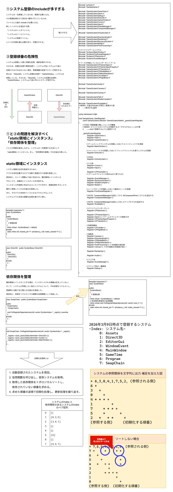

# 実装後の自己評価

本ゲームのプロジェクトは、各部分の実装前に設計を行い実装した。  
本ドキュメントでは、実装後得られた効果について、  
プロジェクト概要と対応付けてまとめる。

## 2つの構造について

ゲームベース側とゲーム側に分けたことにより以下の効果を得られた。

- ゲームベース側とゲーム側のコードが入り混じることがなく、  
  ゲームベース側の再利用が可能となった。

## ディレクトリで分けたことについて

ゲームベース側とゲーム側をディレクトリで分けた。  
結果、ゲームベース側はゲーム側を参照することが一切なくなった。  
これにより以下の効果が得られた。

- ゲームベース側
- ゲーム側

## ECS設計を取り入れたことで

<!-- TODO: 実際に計測してみる -->

## ソースコードについて

使用言語C++のバージョン20を使ったことにより以下の効果を得られた。

- `std::filesystem::path`が利用可能になり、ソースコードをUTF-8文字コードで書いたまま、  
  ファイルパスを文字化けすることなく扱うことができた。

<!-- TODO:... -->

### システムの登録について

- システム登録をゲーム本体クラスで行うことにより、  
  ゲームベース側とゲーム側の分離を実現。
- 登録処理の一元管理ができる反面、大量のインクルードと、登録順番の管理が重要になった。  
  => システム間の参照情報から、トポロジカルソートを活用し、登録順番を自動でソートすることで解決できると考えた。

### 曲の再生について

- SMFを用いることで、曲の一時停止と途中再生、楽器を分けた演奏、スロー再生を実現した。

### カメラの挙動について

- カメラの挙動をプレイヤーボールのバウンドに合わせることにより、  
  落下中は自然と地面との距離を強調でき、地面に着地後のバウンド後、  
  上昇中はプレイヤーボールが上昇している表現を強調できた。

### JSONについて

- ゲームオブジェクトに付属するコンポーネントや、ゲームオブジェクト固有の値について、  
  JSONファイルしたことで、ソースコード内のマジックナンバーを除去できた。
- JSONファイル からゲームオブジェクトを生成できるため、  
  同じ動作をするゲームオブジェクトの複製を、ソースコード側にパラメータを渡すことなく実装できた。
- JSONファイルの読み込みはシーン読み込みのタイミングで行われるため、値を更新し、確認するために、
  シーンの読み込みが必要になった。
  => ImGuiで実行中にJSONファイルの値を更新、JSONファイルの変更検知時に、  
  メモリ上のゲームオブジェクトの値をJSONファイルと同期させることで、この問題を解決できると考えた。
<!-- TODO: 実装例のリポジトリのファイルリンクを追加する -->
□