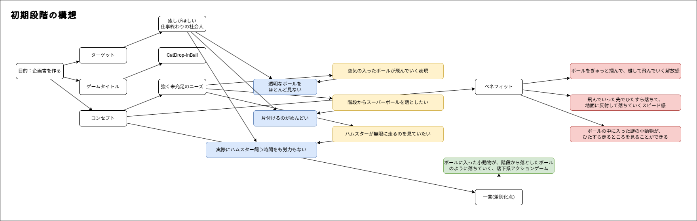
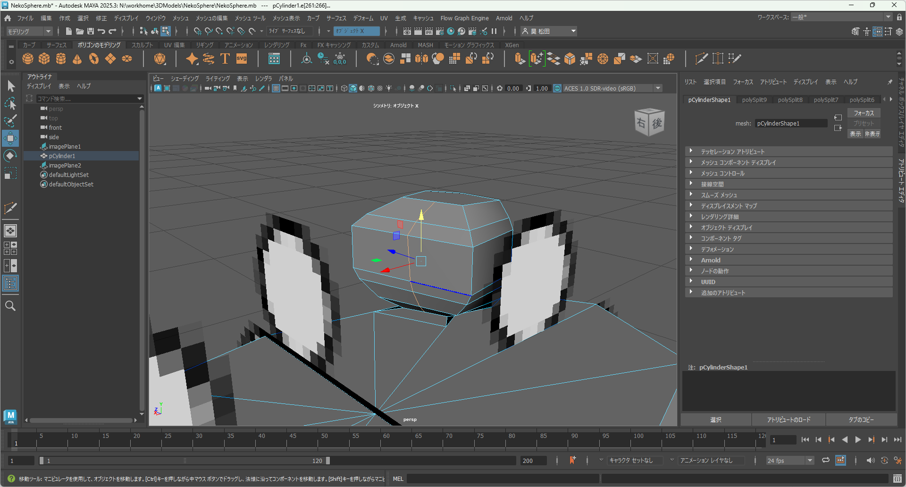
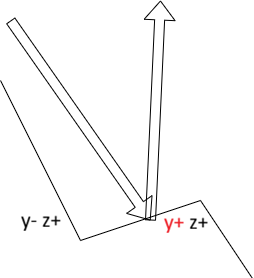
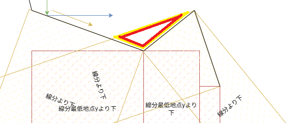
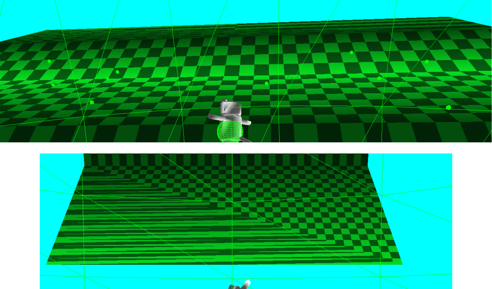
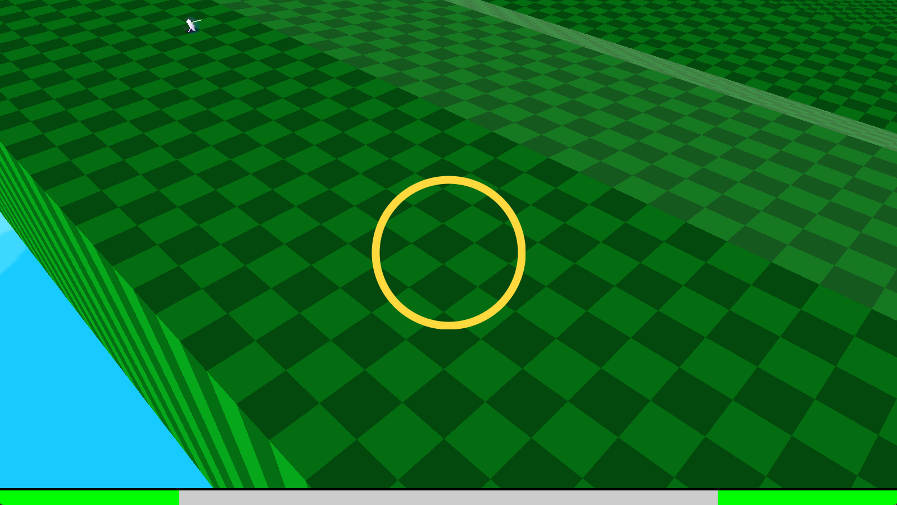
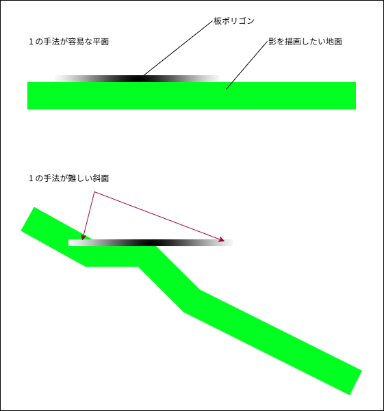
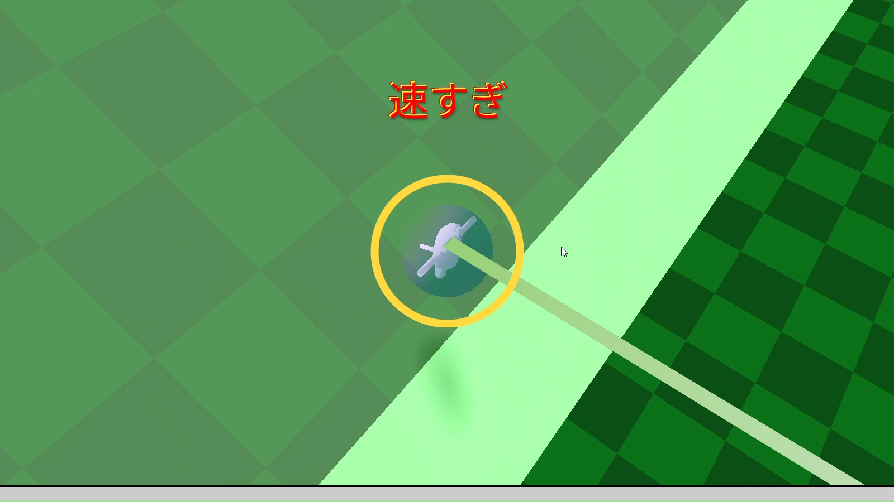

# アピールポイント

　このドキュメントでは、本プロジェクトを制作する過程で苦労した点と  
その解決方法を要点ごとにまとめました。

## 感情の変化を作る

　先生からゲームが面白くなる要素は「感情の変化」だと聞き、かなり悩みました。  
開発初期では、落ちていくボールを観察する落ち着いた画面イメージで進めていたため、  
感情の変化を付け加えるゲームロジックのイメージが全く湧きませんでした。

　そこで、感情の変化を生み出すゲームロジックを考えることをやめ、  
プレイすると強制的に感情の変化が起こるようにできないかと考えました。

　そこで思いついた方法が、音楽でした。  
普段私が学校から帰宅し、疲れを吹き飛ばすために聴いていた音楽は、  
どんなに気分が落ち込んでも強制的に曲調と同じ感情にさせてくれます。  

　音楽は聞くだけで感情の変化を作れると考え、今の実装になりました。

## モデルづくり

　初期段階の構想に記載の通り、このゲームにはボールの中に入るキャラクターが必要です。

　初期段階の構想で企画書を作り、クラス内複数の学生から評価を受ける機会がありました。  
そこで、ボールに小動物を入れる点について「動物虐待だ！」という感想を受け、悩みました。  
考えた結果、ボールの中に入るキャラクターは動物ではなく、2足で立つ謎の生物という設定にしました。  

　しかしその設定が原因で、Web上でフリーのモデルを探しても良いモデルは見つかりませんでした。  
そのため、自力で3Dモデリングにも挑戦しました。  

モデリングソフトのMayaは授業で習っていたことから1年の使用経験があり、  
ある程度使い方は理解していましが、2足で立つ人型のモデル制作は初挑戦でした。  

真横から並行投影した図を2面用意し、なんとか2足で立つキャラクターはできましたが、  
耳の部分はやや納得の出来ではありません。  
実はテクスチャーのUVを綺麗に貼ることができていないため、顔以外の部位に模様を描けませんでした。  
結果、全身真っ白のキャラクターが完成、斜めに伸びる尻尾がチャームポイントです。

## ステージ

### ステージの当たり判定

　現在、ステージは頂上の頂点から連続で全ての線分が `y- z+` の方向に伸びています。  
しかし、制作当初は`y- z+`に加え、`y+ z+`の線分も実装予定でした。  

　バウンドしたボールへの減速要素も加える予定でしたが、ボールと地形の当たり判定は  
線分より下を当たっている判定としたため、意図しない挙動を起こしてしまいました。

　そこで、`y- z+`の線分のみで生成するように実装しました。

### ステージ生成

　このゲームでは予測不可能な傾斜の坂をボールが落下していくため、  
ステージを予めモデリングするのではなく、自動生成する必要がありました。  

　制作当初は頂点を増やし各頂点にポリゴンを張り付け、単一のモデルを自動生成する手法で実装しました。  
しかし、実装してみるとラスタライザが理想のUVを構成しませんでした。

　そこで、単一モデルから複数モデルでの描画に変更、1つの面ごとに分割したモデルを描画することで  
UV構成の問題を解決しました。

## 影

　影の実装に取り掛かった際、影の実装手法に悩みました。  
実装手法として  

1. 影の板ポリゴンのゲームオブジェクトをプレイヤーの直下に常に配置する
2. シェーダでステージに影を描画する
3. シャドウマップを実装する

　上記の手法のうち、このゲームには斜面があるため、1 は難しいと判断しました。  
  
　また、プレイヤーの影を丸く描画する程度で、半透明なボールがあることから、  
3 も難しいと判断し、結果的に 2 を実装することにしました。  

実装してみると、斜面も違和感なく描画することができました。  
  
